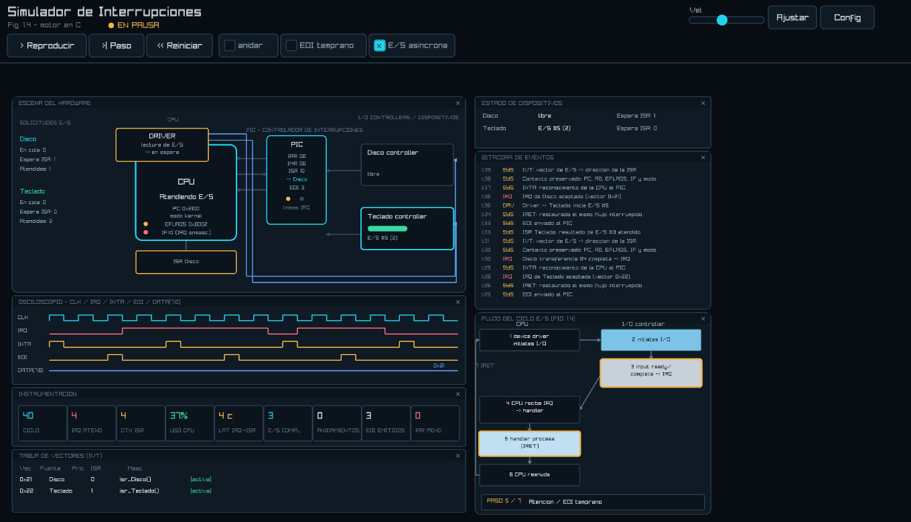

# Manual del Simulador de Interrupciones de E/S

> Guía para **cualquier persona del equipo**, aunque no haya tocado el proyecto.
> Explica qué es, cómo instalarlo, cómo compilarlo, cómo usarlo y **qué está
> ocurriendo** en pantalla (la teoría detrás).



---

## 1. ¿Qué es este programa?

Es un **simulador educativo del mecanismo de interrupciones de Entrada/Salida
(E/S)** de un sistema operativo, escrito en **C**. Reproduce, paso a paso y en
tiempo real, el *ciclo de E/S dirigida por interrupciones* de la **Figura 1.4**
del libro de Silberschatz (*Operating System Concepts*, 10.ª ed.).

En palabras simples: cuando un programa pide leer del disco o del teclado, la
CPU **no se queda esperando**. Lanza la operación y sigue trabajando; cuando el
dispositivo termina, **avisa** a la CPU mediante una *interrupción*. El
simulador muestra ese ida y vuelta con animaciones: la CPU, el controlador de
interrupciones (**PIC**), la tabla de vectores (**IVT**), los dispositivos, el
guardado de contexto y la rutina de atención (**ISR**).

Hay dos formas de verlo:

- **Interfaz gráfica interactiva** (`simulador_gui`): la principal, con escena,
  osciloscopio, flujo de la figura y controles.
- **Modo consola/traza** (`simulador`): sin ventana, imprime una bitácora y/o
  genera un CSV. Útil para revisar la lógica o hacer pruebas.

---

## 2. Requisitos

- **Windows** con **MSYS2** (entorno UCRT64). Trae `gcc`, `make` y `git`.
- La librería gráfica **raylib**.

> ¿No tienes MSYS2? Instálalo desde <https://www.msys2.org> (descarga el
> instalador, siguiente-siguiente). Luego abre la aplicación **"MSYS2 UCRT64"**.

---

## 3. Instalación paso a paso

### Opción A — Terminal MSYS2 UCRT64 (recomendada)

Abre **"MSYS2 UCRT64"** desde el menú Inicio (el prompt debe decir `UCRT64`) y
ejecuta, una sola vez:

```bash
pacman -S mingw-w64-ucrt-x86_64-gcc make mingw-w64-ucrt-x86_64-raylib
```

Confirma con `Y` cuando pregunte.

### Opción B — PowerShell (si prefieres no cambiar de terminal)

Con MSYS2 instalado en `C:\msys64`, en PowerShell:

```powershell
# instalar raylib (y gcc/make si faltan)
& C:\msys64\usr\bin\pacman.exe -S mingw-w64-ucrt-x86_64-gcc make mingw-w64-ucrt-x86_64-raylib
# agregar los compiladores al PATH de ESTA ventana
$env:Path = "C:\msys64\ucrt64\bin;C:\msys64\usr\bin;" + $env:Path
```

> El `$env:Path` dura solo esa ventana de PowerShell; si abres otra, repítelo.

---

## 4. Obtener el código y compilar

```bash
# 1) clona el repositorio (si aún no lo tienes)
git clone https://github.com/devrenato56/io-interruptions-simulator.git
cd io-interruptions-simulator

# 2) ponte en la rama del simulador completo
git checkout feature/simulador-nucleo

# 3) compila la interfaz gráfica
make

# 4) ejecútala
./simulador_gui          # en PowerShell: .\simulador_gui.exe
```

Otros comandos del `Makefile`:

| Comando      | Qué hace                                                        |
|--------------|-----------------------------------------------------------------|
| `make`       | Compila la **interfaz gráfica** (`simulador_gui`).               |
| `make cli`   | Compila el **modo consola/traza** (`simulador`).                 |
| `make test`  | Compila y ejecuta las **pruebas** de la lógica.                  |
| `make run`   | Genera `trace.csv` con 400 ciclos del modo consola.             |
| `make clean` | Borra binarios y trazas.                                         |

Modo consola con opciones:

```bash
make cli
./simulador --ciclos 400 --anidar --salida trace.csv   # 400 ciclos, con anidamiento
./simulador --verboso --ciclos 60 --salida -           # imprime la bitácora en pantalla
```

Opciones: `--ciclos N`, `--anidar`, `--eoi-temprano`, `--sincrono`,
`--salida ARCHIVO` (o `-` para no escribir), `--verboso`.

---

## 5. La interfaz por dentro (qué es cada zona)

**Barra superior (controles):**

- **● EN VIVO / EN PAUSA** — indica si la simulación está corriendo en tiempo
  real o pausada.
- **Reproducir / Pausa** — inicia o detiene la simulación continua.
- **Paso** — avanza **un solo ciclo** (ideal para explicar paso a paso).
- **Reiniciar** — vuelve al estado inicial.
- **anidar / EOI temprano / E/S asíncrona** — variantes didácticas (ver §7).
- **Vel** — velocidad de la reproducción.
- **Ajustar** — encuadra toda la vista en la ventana.
- **Config** — muestra u oculta cada panel y reinicia el layout.

**Paneles (lienzo):**

- **Escena del hardware** — la CPU (con su **driver** encima), el **PIC**
  (registros IRR/IMR/ISR, líneas de IRQ), los **controladores/dispositivos**
  (Teclado y Disco) con su barra de progreso y las **solicitudes de E/S**
  identificadas por número, en cola o esperando ISR. Las líneas entre
  bloques son los **buses** (con flechas que indican el sentido).
- **Osciloscopio** — las señales en el tiempo: **CLK** (ciclos de simulación), **IRQ**
  (petición de interrupción), **INTA** (reconocimiento de la CPU), **EOI** (fin
  de interrupción) y **DATA[7:0]** (el vector que viaja por el bus).
- **Flujo del ciclo E/S (Fig. 1.4)** — la representación del ciclo; el
  nodo activo se **ilumina** y abajo aparece "PASO X / 7".
- **Bitácora de eventos** — el registro de lo que va pasando (SYS/IRQ/DRV).
- **Tabla de vectores (IVT)** — vector, fuente, prioridad e ISR de cada
  dispositivo. **Clic en una fila** para enmascarar/activar esa línea.
- **Estado de dispositivos** y **Métricas** — resumen numérico en vivo.

---

## 6. Controles del lienzo (tipo AutoCAD)

- **Zoom:** rueda del ratón (hace zoom hacia donde apunta el cursor).
- **Mover / desplazar:** arrastra con el **botón derecho** del ratón.
- **Ajustar todo a la ventana:** botón **Ajustar** o tecla **F**.
- **Reiniciar la vista:** tecla **R**.
- **Mover un panel:** arrástralo desde su **barra de título**.
- **Cerrar un panel:** la **X** en su esquina superior derecha.
- **Volver a mostrar paneles:** botón **Config** → marca la vista, o
  "Reiniciar layout".
- La **ventana** se puede redimensionar y maximizar.

---

## 7. ¿Qué está ocurriendo? (la teoría, paso a paso)

El ciclo que ves es exactamente el de la Figura 1.4. Con el botón **Paso** puedes
recorrerlo. Los pasos y lo que se ve en pantalla:

1. **El driver inicia la E/S.** El flujo principal solicita leer (p. ej. del Disco). El
   *device driver* traduce la petición a órdenes para el controlador. En la
   escena, la tarjeta **DRIVER** se enciende sobre la CPU; en el flujo se
   ilumina el nodo 1.
2. **La CPU ordena la E/S al controlador** (*initiates I/O*). La solicitud se
   encola en el dispositivo y conserva su identificador hasta atenderse.
3. **El controlador ejecuta la E/S en paralelo.** La barra del dispositivo
   avanza mientras la CPU continúa el mismo flujo o atiende una ISR. (Con **E/S
   asíncrona** el dispositivo avanza a su propio ritmo.)
4. **El controlador termina y genera una IRQ.** El **PIC** marca el bit en su
   registro **IRR**; en el osciloscopio sube la línea **IRQ**. Nodo 4.
5. **La CPU detecta la IRQ entre instrucciones.** Reconoce con **INTA**, guarda
   el **contexto** (PC, registros, flags), consulta la **IVT** para hallar la
   rutina (el **vector** aparece en **DATA**) y salta al **handler (ISR)**.
   Nodo 5. La CPU pasa a **modo kernel** (LED ámbar).
6. **El handler procesa, emite EOI y retorna (IRET).** Se atiende el resultado
   de una solicitud; el PIC recibe el **EOI**.
7. **La CPU reanuda** la tarea interrumpida justo donde estaba. Vuelve el nodo 1
   (flecha de realimentación "7 · IRET").

Solo la finalización de E/S genera IRQ. El reloj de los dispositivos representa
su tiempo de servicio; CLK permite observar los ciclos de la simulación.
No hay temporizador de interrupciones ni planificación entre procesos.

### Métricas que verás moverse

- **IRQ atendidas**, **E/S completadas**, **contextos guardados para ISR**, **uso de
  CPU**, **latencia IRQ→ISR**, **anidamientos**, **EOI emitidos**, **IRR
  pendientes**.

---

## 8. Las variantes didácticas (toggles)

- **anidar** — permite el **anidamiento de interrupciones**: dentro de un ISR se
  ejecuta `STI` y una IRQ de **mayor prioridad** puede interrumpir al handler en
  curso; al terminar, se reanuda el ISR externo. Verás crecer el contador
  **anidamientos**.
- **EOI temprano** — cambia el **momento** en que se envía el fin de interrupción
  (antes o después de procesar el ISR).
- **E/S asíncrona** — alterna el **modelo de tiempo** del dispositivo: un paso
  de servicio cada dos ciclos, o uno por ciclo. Los dispositivos avanzan también
  durante las ISR en ambos modos.

Sugerencia para la exposición: activa **anidar**, pon **Vel** al medio y observa
en la bitácora los mensajes `[ANIDADA]` y `ISR hace STI`.

---

## 9. Modo consola (sin ventana)

Si solo quieres ver la lógica o generar datos:

```bash
make cli
./simulador --verboso --ciclos 40 --salida -
```

Imprime una bitácora como:

```
t3  [DRV] Driver -> Teclado: inicia E/S #1.
t6  [DRV] Driver -> Disco: inicia E/S #2.
t11 [IRQ] Teclado: transferencia #1 completa -> IRQ.
...
== Resumen ==  ciclos, IRQ atendidas, E/S completadas, uso de CPU, ...
```

Y con `--salida trace.csv` genera un CSV (una fila por ciclo) para análisis.

---

## 10. Problemas comunes

| Síntoma | Causa / solución |
|---|---|
| `pacman: no se reconoce` | Estás en PowerShell/CMD, no en MSYS2. Abre "MSYS2 UCRT64", o llama a `C:\msys64\usr\bin\pacman.exe`. |
| `raylib.h: No such file` o error de enlazado | No se instaló raylib o estás en la terminal equivocada. Usa la **UCRT64** e instala `mingw-w64-ucrt-x86_64-raylib`. Verifica con `pkg-config --modversion raylib`. |
| `make: command not found` | `pacman -S make` (o usa `mingw32-make`). |
| La ventana no abre / error OpenGL | Driver de video antiguo. Prueba en otra máquina o pídeme la bandera de render por software. |
| Se ve cortado / no entra todo | Pulsa **Ajustar** (o **F**), o maximiza la ventana y haz zoom con la rueda. |

---

## 11. Nota importante sobre el alcance

El alcance incluye múltiples dispositivos de E/S, prioridades, máscaras y
anidamiento. Se excluyen temporizador, quantum y planificación de procesos.
La CPU guarda y restaura el mismo flujo interrumpido.
Los detalles técnicos están en [`ARQUITECTURA.md`](ARQUITECTURA.md).
